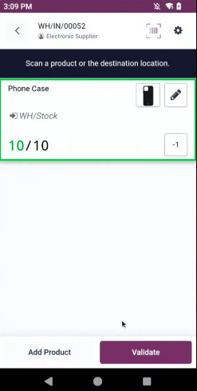
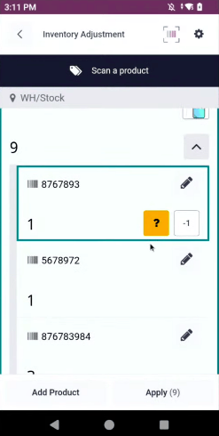

==========================================
Scanning RFID barcodes to manage inventory
==========================================

Make sure the RFD40 scanner is paired and connected to the mobile computer or smartphone. Scanning
the barcode pulls up the relevant inventory or manufacturing documents in Odoo on the mobile device.

Overview of the workflow
========================

#. With the RFD40 scanner in hand, open the **Barcode** app on the computer or phone.
#. Open the operation record (via the **Barcode** interface or scanning the operation barcode).
#. Scan the RFID barcodes for the product.

Manage inventory
----------------

To begin managing inventory using RFID tags, open the **Barcode** app on the smart device.

From there, scan the operation barcode or tap the :guilabel:`Operations` button to open operations
for receipts, internal transfers, delivery orders, or manufacturing orders. If the reading device is
not connected, Odoo will connect to the device. When the device is connected, a toast notification
appears on the screen that verifies the connection. Scan the products, then validate the scan on the
mobile computer or smartphone.

Counting inventory
------------------

Count inventory in the **Barcode** app by opening the :guilabel:`Inventory count`. Scan the products
to count, then apply the count on the smart device.

